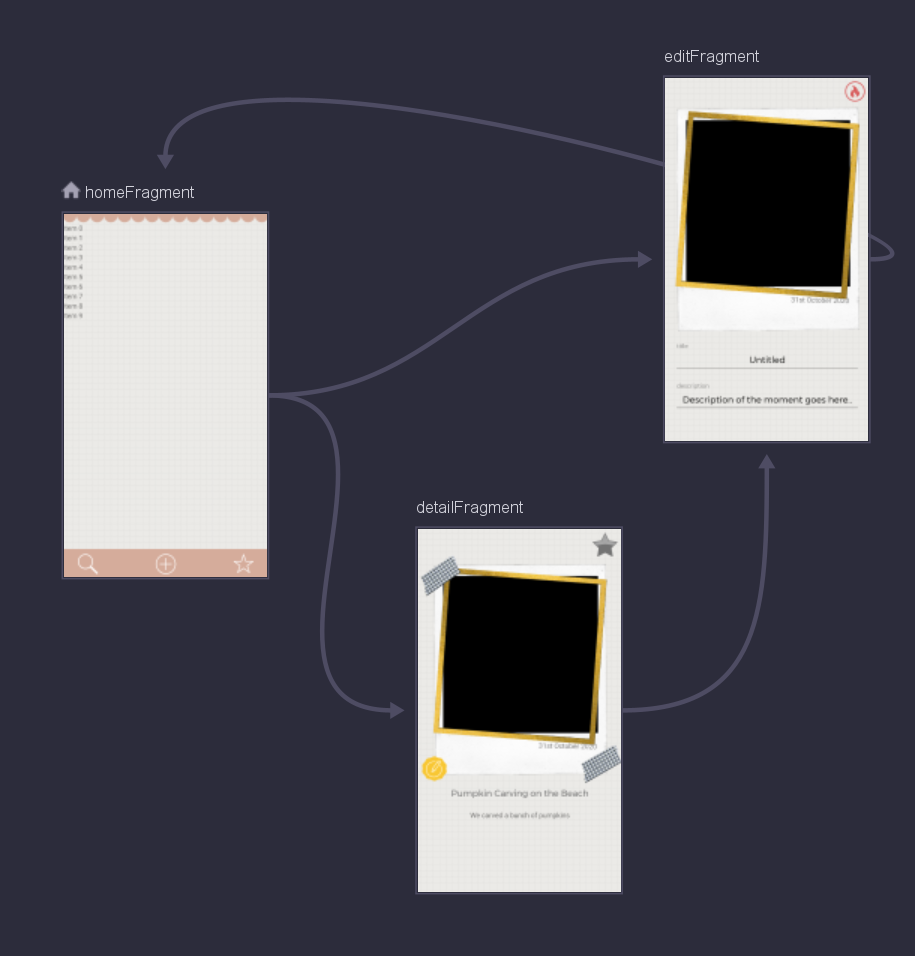

# This Moment

An app that helps you stay mindful of your novel experiences. 
Some days you might have three key moments, such as “the first time I painted with gouache”, 
“the first time I changed a tire” or “the first time I stayed up all night”.
 


https://www.youtube.com/watch?v=LbYnZcrKMyc

# TO-DO

 - Folder Structures (Bookcase Style)
 - Fix Landscape Mode
 - Add Options Menu (Catering to personal design changes, i.e. themes)
 - Add more animations (delete icon, edit icon etc...)

# Vision

Some people believe that novel experiences make your life feel longer.
One common way to remember your life is through diaries and journals. 
I find these methods hard to fill and time-consuming. 
Instead, I like to record moments when I’ve done something for the first time. 
This way you can start to find all the little things that make up your unique experiences in life.

*With This Moment, take note and remember that unique feeling.*

This app could also be used to record the moments of someone else and keep separate categories. For example:

- The first time your child makes a friend on their own
- A couples first time camping together
- The first time your pet slept the whole night without making a sound

# UX Design

The design should be **Minimalist** and *Whimsical*
The focus should be completely around your saved moments and shouldn't distract with obnoxious ui elements.

With this in mind I stuck to a neutral colour scheme with simple but recognizable shapes for the icons,
frames and layout:


The inspiration for the app is scrap-booking. Scrap-booking involves identifying important events from 
your life and then displaying them creatively. **But** scrap-booking tends to be time-consuming and expensive, with 
This Moment I want users to focus on their moments rather than spending hours trying to scrapbook them in the perfect 
way.


# Architecture

[Appendix A: Architecture Diagram](#Appendix-A-Architecture-Diagram)

The architecture of this moment uses best practice recommendations from google. I paid special attention
to the Jetpack libraries which offer a number of useful tools and techniques for structuring android applications.

I split the app into two packages: `ui` and `data`. The UI layer holds Android specific classes such as Fragments, 
Activities, ViewModels and the like. The Data layer defines our domain model and provides objects to help with creating, 
reading, updating and deleting moments.

## Data Layer

The data layer has one job: Provide `CRUD` functionality for `Moment`'s to the UI layer.

A `Moment` is the core data type for our app:

```
@Entity(tableName = "moment")
data class Moment(
    @PrimaryKey(autoGenerate = true)
    val id: Long,
    val title: String,
    val description: String,
    val date: ZonedDateTime,
    val photo: Uri?,
    val starred: Boolean
) 
```

The data layer provides `Moment`'s through the  `MomentRepository` that allows the UI to query all moments, query a 
single moment, create new moments, update existing moments and delete existing moments.

Behind the scenes the `MomentRepository` depends on the `MomentDAO` which uses the `Room` library to access a
local SQLite database containing our `Moment`'s.

I chose to use Room and SQLite as they seemed like the most appropriate choice. The other alternatives
didn't seem like a good fit:

- Shared Preferences: Designed for small amounts of key-value data. Not large number of objects.
- Internal Storage: We would need to serialize/deserialize Moments and design a layer for querying them. Much more work then Room
- External Storage: Same issues as Internal Storage, though we do use External Storage indirectly for photo files. 

Room also has the advantage of making it really easy to provide `LiveData` of `Moment`. We use `LiveData` heavily
in the UI layer, so it's nice to have it automatically available.

## UI Layer

We break the UI layer into screens and shared components. Each screen has a `Fragment`, `layout_xml` and `ViewModel`. The
Home screen also has an `Adapter` as it uses a `RecyclerView`. 

### Screen Architecture

This Moment has a single `MainActivity` which hosts a `Fragment` for each screen. I decided to use this approach, instead
of the traditional one-activity-per-screen approach for a few reasons:

- It is recommended in the Google guide to app architecture
- The Jetpack navigation component prefers the multi-fragment approach
- `ViewModel`'s are easier to integrate into `Fragment`'s 

All screens follow the same basic structure:

1. Query the Moment(s) we are interested in using LiveData and observe them from the `ViewModel`
2. Render the observed LiveData to the screen
3. Attach callbacks to user actions we care about. 
4. When these actions occur, send a command to the `ViewModel` or `Navigation`. If this updates the queried state, we automatically return to step 1

We can see an example of this approach in the `DetailFragment`:

```
class DetailFragment : Fragment() {
    ... 
    override fun onViewCreated(view: View, savedInstanceState: Bundle?) {
        super.onViewCreated(view, savedInstanceState)

        // 1. Query the Moments we are interested in
        viewModel.observeMoment(args.momentId).observe(viewLifecycleOwner, Observer { moment ->
            // 2. Render the observed data to the screen
            momentImageView.setPhoto(moment.photo)
            momentImageView.setDate(moment.date)
            momentTitle.text = moment.title
            momentDescription.text = moment.description
            starButton.isChecked = moment.starred

            // 3. Attach callbacks to user actions we acare about
            momentEditButton.setOnClickListener { onEditClicked() }
            starButton.setOnCheckedChangeListener { _, isChecked -> onStarClicked(moment, isChecked) }
        })
    }

    private fun onEditClicked() {
        // 4. Action occurred: Send command to Navigation
        val action = DetailFragmentDirections.toEdit(args.momentId)
        findNavController().navigate(action)
    }

    private fun onStarClicked(moment: Moment, isStarred: Boolean) {
        // 4. Action occurred: Send command to ViewModel
        viewModel.save(moment.copy(starred = isStarred))
    }
}
```

I chose this model as it provides a fairly clean single-direction data flow. Because the state of the UI is always 
driven by the data model I don't need to worry about issues where the internal memory model gets out of sync with
the UI. 

Google also heavily recommends using LiveData and data to drive your UI as part of the Guide to app architecture (REF).

### Navigation

To navigate between screens I'm using the Jetpack navigation library and the kotlin safe args plugin. This means
I first need to define a navigation graph between my screens, and then use the generated classes to trigger a
navigation. (See [Appendix B: Navigation Graph](#Appendix-B-Navigation-Graph))

I decided to pass the `id` of each Moment between screens instead of passing the whole `Moment` object. The main
advantage of this approach is if I have an `id` I can observe the `Moment` in the repository which makes it easier
to set up the `LiveData` -> `Command` -> `Screen Update` cycle discussed in the previous section. It also means if
I navigate back to a screen after updating the `Moment` the data will be updated correctly. 

If I used a `Parcelable` moment instead this wouldn't work since the `Moment` on the back-stack would be the old
non-updated `Moment`.  

### User Input Validation 

This Moment accepts, Text, Date and Image input as part of the `Edit` fragment. Text is unvalidated as any text is
acceptable. Date validation is done with `DatePickerDialog` to force the user to input a valid date. Images are
validated by using external Activities (Camera and Gallery), ensuring that we either get a valid image or no image.

# Appendix A: Architecture Diagram


# Appendix B: Navigation Graph


