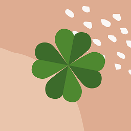
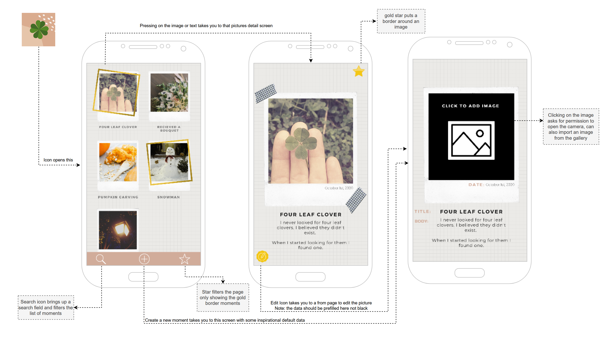
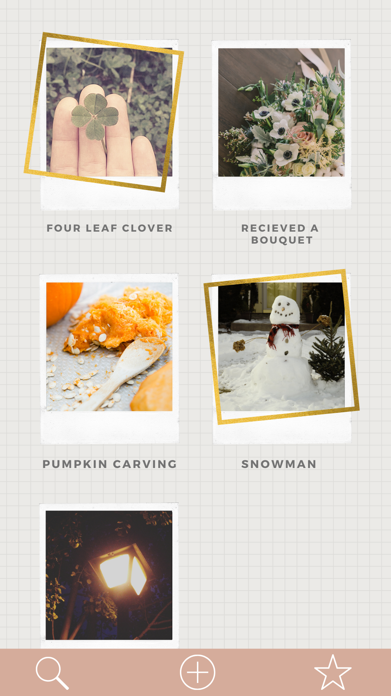
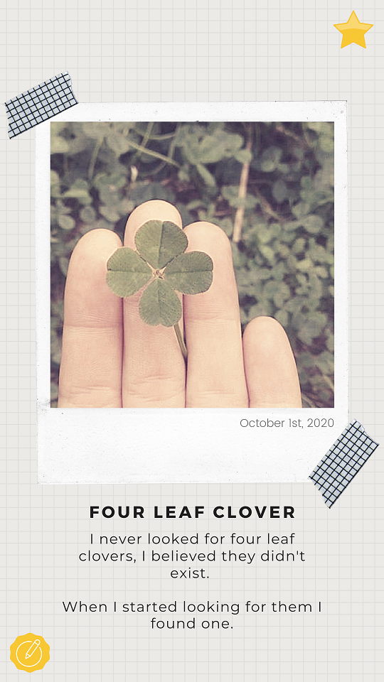
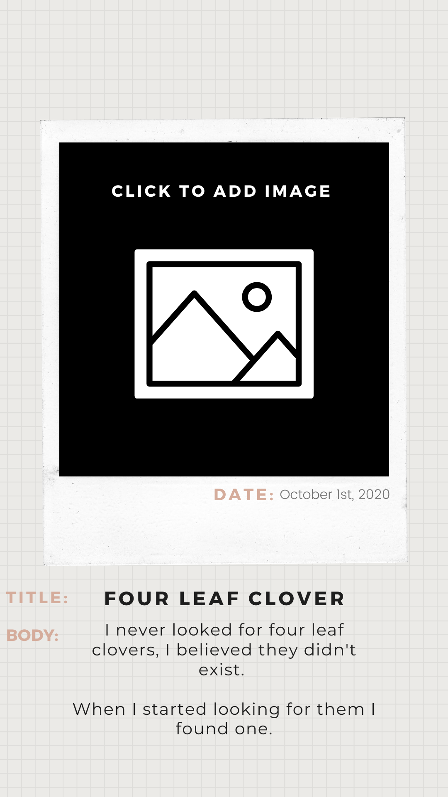

# App Design Document

## Vision: This Moment

Some people believe that novel experiences make your life feel longer.
One common way to remember your life is through diaries and journals. 
I find these methods hard to fill and time consuming. 
Instead I like to record moments when I’ve done something for the first time. 
This way you can start to find all the little things that make up your unique experiences in life.

**This Moment** would be an app that helps you stay mindful of your novel experiences. 
Some days you might have three key moments, such as “the first time I painted with gouache”, 
“the first time I changed a tire” or “the first time I stayed up all night”.

*With This Moment, take note and remember that unique feeling.*

This app could also be used to record the moments of someone else and keep separate categories.

*For example*

A folder containing your child’s moments might have:

- The first time “your child’s name” makes a friend on their own
- The first time “your child’s name” performed on a stage

Or a folder for you and your partner:

- Our first time camping together
- Our first time baking together

Maybe even one your pet:

- First time “pet’s name” slept the whole night without making a sound
- First time “pet’s name” fetched a ball

## UX Design

The design should be **Minimalist** and *Whimsical*
The focus should be completely around your saved moments and shouldn't distract with obnoxious ui elements.

With this in mind I stuck to a neutral colour scheme with simple but recognizable shapes for the icons,
frames and layout:

### Home Screen

The home screen is the first screen you see when opening the app. It shows a scrollable grid of
your moments that you can tap on to view in more detail.

Images will be resized and cropped to match the background frame. We also will display a gold 
border with a slight tilt on moments that are starred. The degree of the tilt will be chosen at
random (within a specific range) to create a sense of movement throughout the page.

The bottom bar acts as an action bar, not just a navigation bar. Inspiration was drawn from 
Instagram which is also about users creating their own content and their content being the star
of the show. I placed the "Create" action front-and-center since it's the key action of the app.

The search button will make a search bar appear at the top of the screen which can filter
moments by their text content. The star button will filter the list to only include starred moments.

### Detail Screen

The inspiration for this screen was taken from scrapbooking. Scrapbooking involves identifying
important events from your life and then displaying them in a creative way. But scrapbooking
tends to be time consuming and expensive, with This Moment I want users to focus on their
moments rather then spending hours trying to scrapbook them in the perfect way.

I've placed the gold star and edit buttons in locations where the users fingers don't usually
rest. This is to help avoid accidental taps and to keep the focus on the content, not the actions.

I've made both actionable buttons use the same type of gold to indicate the user that both are
meant to be pressed. 

The date is placed on the photo as a homage to when we wrote the date of photos physically on the
back.

### Create / Edit Screen

This screens acts as both the create and edit screens. When creating a new moment the fields
will be filled with some inspirational placeholder text, and when editing an existing moment
the fields will be pre-filled with the correct data.

The title and description are intentionally limited in text length. I didn't want the user to 
have to scroll to view a moment and I wanted to encourage them to pick their words carefully. This
also helps us with layout constraints.

This screen will also include a delete button, however that is not currently visible in the design.

## User Stories

### Busy Student

As a busy student, I want to quickly document cool new things that I'm getting to do, so that when 
I look back on my university experience I get a broad view of all the things I accomplished.

### Parent

As a privacy conscious parent, I want to record my child's important moments without sharing it
to the world, so that when they grow up I can share these moments with them and be confident that
their privacy is respected. 

As a parent, I want to find the absolute top highlights of Rose's year to share with their 
grandparents after a year in pandemic-induced isolation.

### Pet Owner

As a pet owner, I want to remember all the little things that Spot does, so that I can look back
on them and see a curated list of special moments, for those times when I'm overwhelmed by the
1000+ images in my gallery.

As a pet owner I want to quickly find a moment to share with my friends, so that everyone can enjoy
Spot's latest antics.

## Use Cases

### Create a new moment

**Task: Create a new moment**
**Purpose: To record a new experience or moment**
**Pre-Conditions: N/A**

| User Interaction | System Response |
|------------------|-----------------|
| 1. Open "This Moment"  | This Moment loads and displays the home screen | 
| 2. Tap the "+" icon on the bottom bar | The system navigates to the create screen. A new moment is created with pre-loaded inspirational text which is then shown on the create screen.  |
| 3. Click the Image icon | The system prompts the user to select an image from their gallery or to take a new photo. If new photo is selected the phone's native camera app opens and the user can take a photo. Either way the selected photo is shown in the image field |
| 4. Update the date if necessary | The system will default to today's date but the user can choose to override the date if needed |
| 4. Enter a title | The text field contains the new title |
| 5. Enter a description | The text field contains the new description |
| 6. Hit the back button | The system navigates back to the home screen and displays the new moment |

### Search for moments with text

**Task: Search for a moment**
**Purpose: To filter the list of moments to ones that contain the search text**
**Pre-Conditions: N/A**

| User Interaction | System Response |
|------------------|-----------------|
| 1. Open "This Moment"  | This Moment loads and displays the home screen | 
| 2. Tap the search icon on the bottom bar | The system displays a search bar at the top of the home screen |
| 3. Enter some search text into the search bar | The system filters the moment list to only include moments that have the search text in their title or description. The filtering occurs as you type |

### Show starred moments

**Task: Show starred moments**
**Purpose: To filter the list of moments to only contain starred moments**
**Pre-Conditions: N/A**

| User Interaction | System Response |
|------------------|-----------------|
| 1. Open "This Moment"  | This Moment loads and displays the home screen | 
| 2. Tap the "Star" icon on the bottom bar | The system filters the moment list to only include starred moments |

## Comparison of Similar Apps

## Prototype

### TODO

Here we will link to the Spike Reports as the prototype is developed.