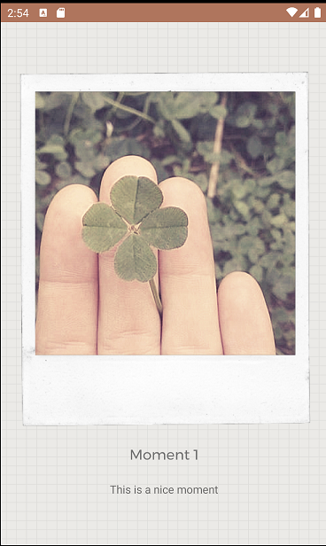
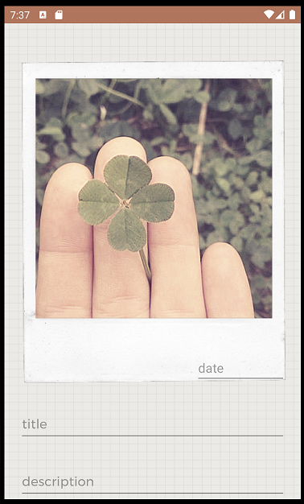
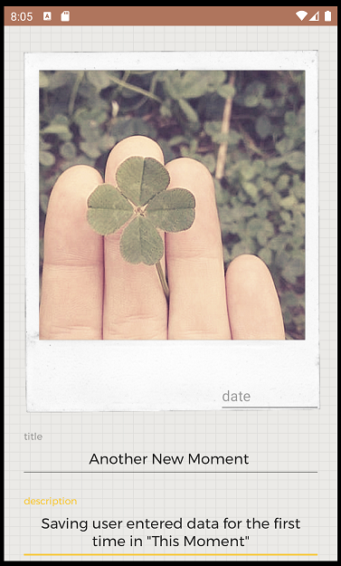
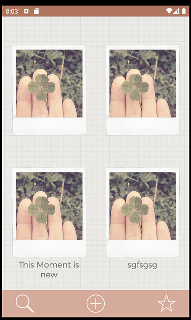
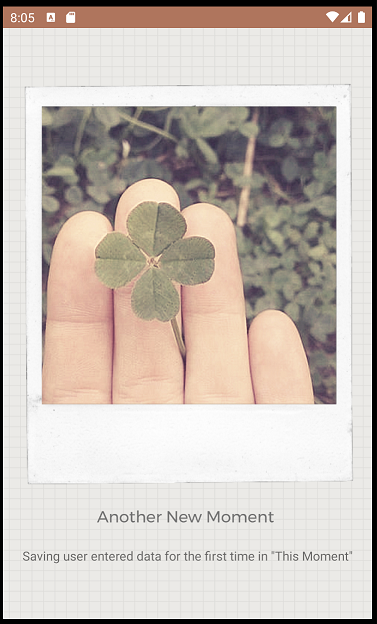

# This Moment - Spike Report

Jessica Woods, 101367036

[Link To Repository](https://github.com/Jessica-Woods/This-Moment-App)

# Goals:

Iteration 1: Create basic home screen [DONE]

- Create Moment data class
- Create Moment Repository with hardcoded data (no image)
- Create functional home screen layout (basic grid, basic viewmodel)
- Integrate repository with home screen
- Add the Bottom Bar to Home with "Create", "Search" and "Star" icons.
- Display the photo frame in the recycler view with a placeholder photo. 

Iteration 2: Create basic detail screen [DONE]

- Accept navigation from Home screen
- Create functional detail screen layout (placeholder image) 

Iteration 3: Create basic edit screen [DONE]

- Accept navigation from Detail screen and Home screen
- Create functional edit screen (text fields, labels, basic viewmodel, no fancy design elements)
- Edited field data is reflected in the database when the field loses focus

Iteration 4: Photos [DONE]

- When tapping the Image on the Edit screen the user should be prompted to take a photo or select an image.
  The selected image becomes the new data for this Moment.
- Selected images should be displayed on the Home, Detail and Edit screens
- Photos should be cropped and scaled in an aesthetically pleasing way

Iteration 5: Core Design [DONE]

- Add Photo frame on all three screens
- Add Photo tape to detail screen
- Add backgrounds if we haven't already done that

Iteration 6: Starring [DONE]

- Add Star icon to top right of Detail screen, when tapped/untapped the state should be updated
- Add Star icon to bottom bar of home screen, it should filter moments to starred moments when active
- Add gold border to starred moments on home screen

Iteration 7: Search [DONE]

- Add Search icon to bottom bar of home screen, it should show/hide the search bar at the top of the screen
- When searching items should be filtered by the contents of the search bar
- If the search bar is disabled the filter should also be disabled

## Features TODO

### Home Screen

- Show all Moments
- Show a gold frame on *star* moments
- Create new Moments
- Search for Moments by text
- Only show *star* moments

### Detail Screen

- See your Moment
- *Star* your Moment
- Edit your Moment
- Fade-in animation for that nostalgic polaroid feel

### Edit Screen (Create + Update + Delete Screen)

- Take a photo, or upload an existing one
- Change the title, date and description
- _Delete_ a moment!


# Gaps

## Gap 1: Basic Home Screen

To develop this app we need three screens: Home, Detail and Edit. This gives us full CRUD functionality as
the edit screen will act as both Create and Update.

I like to start by getting my screens plotted out and connected with dummy data, so let's start with the Home 
screen.

First I create a new empty activity called `HomeActivity` and fill `activity_home.xml` with our layout. In this
case we need a `RecyclerView` to hold each Moment and a bottom bar. Normally this bottom bar would be some
sort of navigation bar but since only one button performs navigation, and the other two do other things I
felt it was easier just to construct my own bar. This means I don't need to override the default navigation
bar behavior, but I have to do more work to set up the layout:

```
<?xml version="1.0" encoding="utf-8"?>
<androidx.constraintlayout.widget.ConstraintLayout
    ...
    android:layout_width="match_parent"
    android:layout_height="match_parent"
    android:background="@drawable/grid_background"
    tools:context=".home.HomeActivity">

    <androidx.recyclerview.widget.RecyclerView
        android:id="@+id/momentsRecycler"
        android:layout_width="match_parent"
        android:layout_height="0dp"
        android:clipToPadding="false"
        android:paddingBottom="20dp"
        app:layout_constraintTop_toTopOf="parent"
        app:layout_constraintBottom_toTopOf="@id/bottomBarBackground">
    </androidx.recyclerview.widget.RecyclerView>

    <View
        android:id="@+id/bottomBarBackground"
        android:layout_width="match_parent"
        android:layout_height="0dp"
        android:background="@color/colorPrimary"
        app:layout_constraintTop_toTopOf="@id/botomBarTopMargin"
        app:layout_constraintBottom_toBottomOf="parent" />

    <!--
        We need this Space to get `bottomBarBackground` to respect the top margin
        of `addButton`
    -->
    <Space
        android:id="@+id/botomBarTopMargin"
        android:layout_width="match_parent"
        android:layout_height="@dimen/bottom_button_vertical_margin"
        app:layout_constraintBottom_toTopOf="@id/addButton" />

    <ImageButton
        android:id="@+id/addButton"
        android:layout_width="@dimen/bottom_button_size"
        android:layout_height="@dimen/bottom_button_size"
        android:layout_marginBottom="@dimen/bottom_button_vertical_margin"
        android:background="@drawable/ic_create"
        android:contentDescription="@string/create_button_description"
        app:layout_constraintBottom_toBottomOf="parent"
        app:layout_constraintLeft_toLeftOf="parent"
        app:layout_constraintRight_toRightOf="parent" />

    <ImageButton
        android:id="@+id/searchButton"
        android:layout_width="@dimen/bottom_button_size"
        android:layout_height="@dimen/bottom_button_size"
        android:layout_marginVertical="@dimen/bottom_button_vertical_margin"
        android:background="@drawable/ic_search"
        android:contentDescription="@string/search_button_description"
        app:layout_constraintBottom_toBottomOf="parent"
        app:layout_constraintLeft_toLeftOf="parent"
        android:layout_marginLeft="@dimen/bottom_button_horizontal_offset" />

    <ImageButton
        android:id="@+id/starButton"
        android:layout_width="@dimen/bottom_button_size"
        android:layout_height="@dimen/bottom_button_size"
        android:layout_marginVertical="@dimen/bottom_button_vertical_margin"
        android:background="@drawable/ic_star"
        android:contentDescription="@string/star_button_description"
        app:layout_constraintBottom_toBottomOf="parent"
        app:layout_constraintRight_toRightOf="parent"
        android:layout_marginRight="@dimen/bottom_button_horizontal_offset" />
</androidx.constraintlayout.widget.ConstraintLayout>
```

One challenge I faced when creating this layout was getting the bottom bar to size itself dynamically based on
the size of the buttons. We have three dimension values in `dimens.xml` that determine the button sizes:

```
<resources>
    <dimen name="bottom_button_size">40dp</dimen>
    <dimen name="bottom_button_vertical_margin">10dp</dimen>
    <dimen name="bottom_button_horizontal_offset">30dp</dimen>
</resources>
```

We want the height of `bottomBarBackground` to be equal to `bottom_button_size + bottom_button_vertical_margin * 2`. 
Unfortunately we can't just calculate this value in XML. Initially I tried to constraint `bottomBarBackground` to
`addButton` which has the right dimensions, but it's not possible to apply a negative margin to constraints like
this since the constraint is not "pushing" against anything.

After a lot of experimentation I settled on adding a `Space` view above `addButton` with the correct margin and
then use that space to give `bottomBarBackground` the correct height. This means when I change the button 
dimensions or margins the bar background automatically resizes itself which I feel is a reasonable solution.

Now that we have our `HomeActivity` we need to sort out the `RecyclerView`. This means we need some hardcoded
data to display, a layout to display it with, and an adapter to tie everything together.

First let's create our `Moment` data class:

```
data class Moment (
    val title: String,
    val description: String,
    val date: LocalDate

    // TODO Starred + Image
) {
    companion object {
        val diff = object : DiffUtil.ItemCallback<Moment>() {
            override fun areItemsTheSame(oldItem: Moment, newItem: Moment): Boolean {
                return oldItem == newItem
            }

            override fun areContentsTheSame(oldItem: Moment, newItem: Moment): Boolean {
                return oldItem == newItem
            }
        }
    }
}
```

I've also added a `diff` object to `Moment` since we'll need it later for our `ListAdapter`. Right now it just 
uses the equals method but later on we'll probably use the `Entity` id for `areItemsTheSame`.

Next, we can create a `MomentRepository` to return our dummy data:

```
class MomentRepository {
    fun getMoments():List<Moment> {
        return listOf(
            Moment("Moment 1","This is a nice moment", LocalDate.now()),
            Moment("Moment 2", "This one is ok", LocalDate.now()),
            Moment("Moment 3","This is a nice moment", LocalDate.now()),
            Moment("Moment 4","This one is ok", LocalDate.now())
        )
    }
}
```

Now we need a layout to draw these moments, I've called it `layout_moment_cell.xml`:

```
<?xml version="1.0" encoding="utf-8"?>
<androidx.constraintlayout.widget.ConstraintLayout xmlns:android="http://schemas.android.com/apk/res/android"
    ...
    android:layout_width="match_parent"
    android:layout_height="wrap_content"
    android:layout_marginTop="40dp"
    android:layout_marginHorizontal="20dp">

    <ImageView
        android:id="@+id/momentFrame"
        android:layout_width="0dp"
        android:layout_height="wrap_content"
        android:adjustViewBounds="true"
        app:layout_constraintTop_toTopOf="parent"
        app:layout_constraintLeft_toLeftOf="parent"
        app:layout_constraintRight_toRightOf="parent"
        app:srcCompat="@drawable/photo_frame" />

    <TextView
        android:id="@+id/momentTitle"
        android:layout_width="wrap_content"
        android:layout_height="wrap_content"
        android:textAlignment="center"
        android:textAppearance="@style/TitleText"
        app:layout_constraintLeft_toLeftOf="parent"
        app:layout_constraintRight_toRightOf="parent"
        app:layout_constraintTop_toBottomOf="@id/momentFrame"
        tools:text="My best moment" />

</androidx.constraintlayout.widget.ConstraintLayout>
```

This should draw an empty photo frame with a title. Now we need an adapter to pull everything together:

```
class MomentAdapter(
    val onClick: (Moment) -> Unit = { _ -> Unit }
) : ListAdapter<Moment, MomentAdapter.ViewHolder>(Moment.diff) {
    inner class ViewHolder(view: View): RecyclerView.ViewHolder(view) {
        val momentTitle: TextView = view.momentTitle
        val momentFrame: ImageView = view.momentFrame

        fun bind(moment: Moment) {
            momentTitle.text = moment.title
        }
    }

    override fun onCreateViewHolder(parent: ViewGroup, viewType: Int): ViewHolder {
        val inflater = LayoutInflater.from(parent.context)
        val view = inflater.inflate(R.layout.layout_moment_cell, parent, false)
        return ViewHolder(view)
    }

    override fun onBindViewHolder(holder: ViewHolder, position: Int) {
        val moment = getItem(position)
        holder.bind(moment)
        holder.itemView.setOnClickListener { onClick(moment) }
    }
}
```

Finally, we can update `HomeActivity` to use the adapter and fetch the data:

```
class HomeActivity : AppCompatActivity() {
    override fun onCreate(savedInstanceState: Bundle?) {
        super.onCreate(savedInstanceState)
        setContentView(R.layout.activity_home)

        momentsRecycler.layoutManager = GridLayoutManager(this, 2)

        val momentAdapter = MomentAdapter()
        momentsRecycler.adapter = momentAdapter

        val momentRepository = MomentRepository()
        momentAdapter.submitList(momentRepository.getMoments())
    }
}
```

We also use a `GridLayoutManager` to achieve the two column layout from the original design:


## Gap 2: Framing photos

Originally I was going to tackle this gap later in the design, but after creating the home screen I wanted to
give it a go and see how hard it was. 

The goal is to fit an arbitrary photo inside the photo frame, to achieve the original style of the design.

To do this we need to modify `layout_moment_cell.xml` to have two `ImageView`'s overlapping each other. We also
need to adjust the photo image view such that it sits at the right offset within the frame and that everything
scales nicely. 

I tried several approaches to make this correct including:

- Manually positioning the frame using `dp` and `px`
- Tweaking various `ImageView` `scaleType`'s and `adjustViewBounds` settings
- Dealing with an error in `GridLayoutManager` where the bounds of the first image are incorrectly set when using `match_parent`

Here's what I was dealing with:


All of these approaches had problems, the main issue was something that looked correct on one device would scale
improperly on other devices.

After a lot of tweaking and some pixel math, I realised that the frame border has a 1:1 aspect ratio of 640x640px. 
This means I need to force every photo into a square aspect ratio and find some way to scale the ImageView's down
correctly relative to each other.

The solution for me was to set the frame `ImageView` to match the parent's width, and then use 
`layout_constraintWidth_percent` on the photo `ImageView` with a percentage based on the distance from the
edge of the frame to the area we want the photo to appear. This works out to `94%` which correctly sizes 
the `ImageView`. Then we use `adjustViewBounds=true` and `scaleType=centerCrop` to force the photo into
a square aspect ratio.

The only problem now is the vertical positioning. At the moment I ended up doing `layout_marginTop=10dp` which
works but may produce slightly wrong results on some screen configurations. Ideally I want the ability
to add a top margin as a percentage of the frame `ImageView` but I couldn't find a nice way to do this.

After a lot of tweaking here's what I ended up with:

```
<?xml version="1.0" encoding="utf-8"?>
<androidx.constraintlayout.widget.ConstraintLayout xmlns:android="http://schemas.android.com/apk/res/android"
    android:layout_width="match_parent"
    android:layout_height="wrap_content"
    android:layout_marginTop="40dp"
    android:layout_marginHorizontal="20dp"
    xmlns:app="http://schemas.android.com/apk/res-auto"
    xmlns:tools="http://schemas.android.com/tools">

    <ImageView
        android:id="@+id/momentPhoto"
        android:layout_width="0dp"
        android:layout_height="wrap_content"
        android:scaleType="centerCrop"
        android:adjustViewBounds="true"
        android:layout_marginTop="10dp"
        app:layout_constraintWidth_percent="0.94"
        app:layout_constraintTop_toTopOf="parent"
        app:layout_constraintLeft_toLeftOf="parent"
        app:layout_constraintRight_toRightOf="parent"
        app:srcCompat="@drawable/picture_placeholder" />

    <ImageView
        android:id="@+id/momentFrame"
        android:layout_width="0dp"
        android:layout_height="wrap_content"
        android:adjustViewBounds="true"
        app:layout_constraintTop_toTopOf="parent"
        app:layout_constraintLeft_toLeftOf="parent"
        app:layout_constraintRight_toRightOf="parent"
        app:srcCompat="@drawable/photo_frame" />

    ...
</androidx.constraintlayout.widget.ConstraintLayout>
```

And here's the result:


## Gap 3: Hosting Fragments in Activities

Now that the Home screen is visually good it's time to take a backend detour as we introduce more pages.

Traditionally we've created apps using a number of Activities, one for each screen. For This Moment I'm going to
instead create a Fragment for each screen and all fragments will be hosted in a single main activity.

Google recommends this approach as of 2018, as part of the overall "Jetpack" architecture (Google 2018). Fragments also 
play nicely with the Navigation tools available in Android Studio which we can use to navigate between our different
screens.

This means I need to set up a new `MainActivity`, change `HomeActivity` to `HomeFragment` and hook everything
back up. Then we can use this scaffolding when we build navigation to the other screens.

First I create a new empty activity called `MainActivity`, and set up an empty `navigation.xml` under
`res/navigation/navigation.xml` using Android Studio. We don't have any routes yet,  but we need this file to 
add the NavHostContainer to `activity_main.xml`.

We also need to update `AndroidManifest.xml` to treat `MainActivity` as the main activity:

```
<manifest xmlns:android="http://schemas.android.com/apk/res/android"
    package="tech.jwoods.thismoment">

    <application ...>
        <activity android:name=".MainActivity">
            <intent-filter>
                <action android:name="android.intent.action.MAIN" />

                <category android:name="android.intent.category.LAUNCHER" />
            </intent-filter>
        </activity>
        ...
    </application>
</manifest>
```

Next I add the `NavHostFragment` to `activity_main.xml`:

```
<?xml version="1.0" encoding="utf-8"?>
<androidx.constraintlayout.widget.ConstraintLayout xmlns:android="http://schemas.android.com/apk/res/android"
    xmlns:app="http://schemas.android.com/apk/res-auto"
    xmlns:tools="http://schemas.android.com/tools"
    android:layout_width="match_parent"
    android:layout_height="match_parent"
    tools:context=".MainActivity">

    <fragment
        android:id="@+id/fragment"
        android:name="androidx.navigation.fragment.NavHostFragment"
        android:layout_width="match_parent"
        android:layout_height="match_parent"
        app:defaultNavHost="true"
        app:navGraph="@navigation/navigation" />
</androidx.constraintlayout.widget.ConstraintLayout>
```

The `NavHostFragment` will hold the current screen and handle creating/deleting fragments as we navigate
between them.

Next let's convert `HomeActivity` from an `Activity` to a `Fragment`. We need to:

- Rename "activity" to "fragment" (`HomeActivity` -> `HomeFragment` and `activity_home` to `fragment_home`)
- Extend `Fragment` instead of `AppCompatActivity`
- Replace `onCreate` with `onCreateView` and `onViewCreated`

We end up with this fragment code:

```
class HomeFragment : Fragment() {
    override fun onCreateView(
        inflater: LayoutInflater, container: ViewGroup?,
        savedInstanceState: Bundle?
    ): View? {
        return inflater.inflate(R.layout.fragment_home, container, false)
    }

    override fun onViewCreated(view: View, savedInstanceState: Bundle?) {
        super.onViewCreated(view, savedInstanceState)

        momentsRecycler.layoutManager = GridLayoutManager(requireContext(), 2)

        val momentAdapter = MomentAdapter()
        momentsRecycler.adapter = momentAdapter

        val momentRepository = MomentRepository()
        momentAdapter.submitList(momentRepository.getMoments())
    }
}
```
 
 Finally, we need to add our new fragment to `navigation.xml`. Since it's the first fragment it becomes the default
 screen we see when opening the app. 
  
That's it! Now we're using Fragments instead of Activities.

## Gap 4: Detail Navigation

When the user taps on a moment we want it to navigate to the detail screen. We can do this using the `navigation.xml`
file we created earlier.

First we create a new empty fragment called `DetailFragment` with a plain text box inside of it.

Then we add it to `navigation.xml` using the IDE tools. We'll make the `DetailFragment` take a single argument called
`moment` of type `Moment`, we also add a navigation action from `HomeFragment` to `DetailFragment`:

```
<?xml version="1.0" encoding="utf-8"?>
<navigation ...>

    <fragment
        android:id="@+id/homeFragment"
        android:name="tech.jwoods.thismoment.ui.home.HomeFragment"
        android:label="fragment_home"
        tools:layout="@layout/fragment_home" >
        <action
            android:id="@+id/action_homeFragment_to_detailFragment"
            app:destination="@id/detailFragment" />
    </fragment>

    <fragment
        android:id="@+id/detailFragment"
        android:name="tech.jwoods.thismoment.ui.detail.DetailFragment"
        android:label="fragment_detail"
        tools:layout="@layout/fragment_detail" >
        <argument
            android:name="moment"
            app:argType="tech.jwoods.thismoment.data.Moment" />
    </fragment>
</navigation>
```

This means we also need to make `Moment` parcelable:

```
@Parcelize
data class Moment (...) : Parcelable {
    ...
}
```

Google recommends using the kotlin "safe args" plugin for navigation arguments, so we need to install it. We add the
following to the **top-level** `build.gradle` (Google 2020a):

```
buildscript {
    ...
    dependencies {
        ...
        def nav_version = "2.3.0"
        classpath "androidx.navigation:navigation-safe-args-gradle-plugin:$nav_version"
    }
}

...
```

We also add the following to the **app** `build.gradle`:

```
...
apply plugin: "androidx.navigation.safeargs.kotlin"

...
```

Next we can set up `DetailFragment` to accept a `Moment` on navigation and bind it to the layout:

```
class DetailFragment : Fragment() {
    private val args: DetailFragmentArgs by navArgs()

    override fun onCreateView(
        inflater: LayoutInflater, container: ViewGroup?,
        savedInstanceState: Bundle?
    ): View? {
        return inflater.inflate(R.layout.fragment_detail, container, false)
    }

    override fun onViewCreated(view: View, savedInstanceState: Bundle?) {
        super.onViewCreated(view, savedInstanceState)

        momentTitle.text = args.moment.title
    }
}
```

Finally, we modify `HomeFragment` to navigate to `DetailFragment` when a moment is tapped:

```
class HomeFragment : Fragment() {
    ...

    override fun onViewCreated(view: View, savedInstanceState: Bundle?) {
        ...
        val momentAdapter = MomentAdapter(onClick = ::onMomentClicked)
        ...
    }

    private fun onMomentClicked(moment: Moment) {
        val action = HomeFragmentDirections.toDetail(moment)
        findNavController().navigate(action)
    }
}
```

Now we can get to the detail screen:


## Gap 5: Detail Screen Design

Let's make the detail screen look better.

The focal point of the screen is the framed photo. This is very similar to the framing on the Home screen, so I'm going
to extract it into a custom view that we can reuse. 

We covered this in my Core 2 spike report and I'm going to use the same technique here.

First we create `view_moment_image.xml` with the stacked `ImageView` layout we had in `fragment_home.xml`:

```
<?xml version="1.0" encoding="utf-8"?>
<merge
    ...
    android:layout_width="match_parent"
    android:layout_height="wrap_content"
    tools:parentTag="androidx.constraintlayout.widget.ConstraintLayout">

    <ImageView
        android:id="@+id/momentPhoto"
        android:layout_width="0dp"
        android:layout_height="wrap_content"
        android:scaleType="centerCrop"
        android:adjustViewBounds="true"
        android:layout_marginTop="10dp"
        android:contentDescription="@string/moment_photo_description"
        app:layout_constraintWidth_percent="0.94"
        app:layout_constraintTop_toTopOf="parent"
        app:layout_constraintLeft_toLeftOf="parent"
        app:layout_constraintRight_toRightOf="parent"
        app:srcCompat="@drawable/picture_placeholder" />

    <ImageView
        android:id="@+id/momentFrame"
        android:layout_width="0dp"
        android:layout_height="wrap_content"
        android:adjustViewBounds="true"
        android:contentDescription="@string/moment_frame_description"
        app:layout_constraintTop_toTopOf="parent"
        app:layout_constraintLeft_toLeftOf="parent"
        app:layout_constraintRight_toRightOf="parent"
        app:srcCompat="@drawable/photo_frame" />
</merge>
```

Then we create the `MomentImageView` class:

```
class MomentImageView @JvmOverloads constructor(
    context: Context,
    attrs: AttributeSet? = null,
    defStyleAttr: Int = 0
) : ConstraintLayout(context, attrs, defStyleAttr) {
    init {
        LayoutInflater
            .from(context)
            .inflate(R.layout.view_moment_image, this, true)
    }

    fun setMoment(moment: Moment) {
        // TODO: Set image from moment
    }
}
```

Now we can update `layout_moment_cell.xml` to use our new `MomentImageView`:

```
<?xml version="1.0" encoding="utf-8"?>
<androidx.constraintlayout.widget.ConstraintLayout ...>

    <tech.jwoods.thismoment.ui.shared.MomentImageView
        android:id="@+id/momentImage"
        android:layout_width="0dp"
        android:layout_height="wrap_content"
        app:layout_constraintTop_toTopOf="parent"
        app:layout_constraintLeft_toLeftOf="parent"
        app:layout_constraintRight_toRightOf="parent"/>

    ...
</androidx.constraintlayout.widget.ConstraintLayout>
```

Next, we can create our design in `fragment_detail.xml` using `MomentImageView` and some `TextView`'s:

```
<?xml version="1.0" encoding="utf-8"?>
<androidx.constraintlayout.widget.ConstraintLayout 
    ...
    android:layout_width="match_parent"
    android:layout_height="match_parent"
    android:background="@drawable/grid_background"
    tools:context=".ui.detail.DetailFragment">

    <tech.jwoods.thismoment.ui.shared.MomentImageView
        android:id="@+id/momentImageView"
        android:layout_width="0dp"
        android:layout_height="wrap_content"
        android:layout_marginTop="60dp"
        app:layout_constraintBottom_toTopOf="@+id/momentTitle"
        app:layout_constraintLeft_toLeftOf="parent"
        app:layout_constraintRight_toRightOf="parent"
        app:layout_constraintTop_toTopOf="parent"
        app:layout_constraintVertical_chainStyle="spread"
        app:layout_constraintWidth_percent="0.9" />

    <TextView
        android:id="@+id/momentTitle"
        android:layout_width="0dp"
        android:layout_height="wrap_content"
        android:textAlignment="center"
        android:textAppearance="@style/TitleText"
        app:layout_constraintHorizontal_bias="0.5"
        app:layout_constraintLeft_toLeftOf="parent"
        app:layout_constraintRight_toRightOf="parent"
        app:layout_constraintTop_toBottomOf="@id/momentImageView"
        app:layout_constraintWidth_percent="0.9"
        android:layout_marginTop="20dp"
        tools:text="Pumpkin Carving on the Beach" />

    <TextView
        android:id="@+id/momentDescription"
        android:layout_width="0dp"
        android:layout_height="wrap_content"
        android:textAlignment="center"
        android:textAllCaps="false"
        app:layout_constraintHorizontal_bias="0.5"
        app:layout_constraintLeft_toLeftOf="parent"
        app:layout_constraintRight_toRightOf="parent"
        app:layout_constraintTop_toBottomOf="@id/momentTitle"
        app:layout_constraintWidth_percent="0.9"
        android:layout_marginTop="20dp"
        tools:text="We carved a bunch of pumpkins" />

</androidx.constraintlayout.widget.ConstraintLayout>
```
 
Finally, we update `DetailFragment` to bind the title and description:
 
```
class DetailFragment : Fragment() {
    private val args: DetailFragmentArgs by navArgs()

    ...

    override fun onViewCreated(view: View, savedInstanceState: Bundle?) {
        super.onViewCreated(view, savedInstanceState)

        momentTitle.text = args.moment.title
        momentDescription.text = args.moment.description
    }
}
```

Here's the result:



## Gap 6: Using Room for Data

We've been using hardcoded data up until this point. We can't keep using hardcoded data if we want to implement the
edit screen, so let's put our data in the local SQLite database using Room.

First we need to add the room dependencies to our **app** `build.gradle` (Google 2020b) (JetBrains 2019):

```
...
apply plugin: 'kotlin-kapt'

...

dependencies {
    ...

    def room_version = "2.2.5"
    implementation "androidx.room:room-runtime:$room_version"
    implementation "androidx.room:room-ktx:$room_version"
    kapt "androidx.room:room-compiler:$room_version"
    testImplementation "androidx.room:room-testing:$room_version"
}
```

Next we need to turn `Moment` into an `@Entity` so Room can store it:

```
@Entity(tableName = "moment")
@Parcelize
data class Moment(

    @PrimaryKey(autoGenerate = true)
    val id: Int,
    val title: String,
    val description: String,
    val date: LocalDate

    // TODO Starred + Image
) : Parcelable { ... }
```

We also introduce the `id` field which is a unique identifier identifying a `Moment` in the database.

Now we need to set up the `MomentDAO` which is responsible for querying the database and providing us CRUD 
capabilities:

```
@Dao
interface MomentDAO {
    @Query("SELECT * FROM moment")
    fun observeMoments(): LiveData<List<Moment>>

    @Query("SELECT * FROM moment WHERE id = :id")
    fun observeMoment(id: Int): LiveData<List<Moment>>

    @Insert(onConflict = OnConflictStrategy.REPLACE)
    suspend fun insert(moment: Moment)
}
```

With the `MomentDAO` we can:

- Query all moments using `observeMoments()`
- Query a single moment using `observeMoment(id)`
- Create or update a moment using `insert(moment)`

We use `OnConflictStrategy.REPLACE` to make `insert` a "Create or Update" method since we're always updating
the entire object.

Next, we create a `ThisMomentDatabase` object that represents our database and provides access to the `DAO` objects:

```
@Database(entities = [Moment::class], version = 1, exportSchema = false)
abstract class ThisMomentDatabase : RoomDatabase() {
    abstract fun momentDao(): MomentDAO
}
```

We have a problem though, how do we give our `ViewModel` access to the database? 

## Gap 7: Dependency injection with Hilt

The simplest way to inject the database would have been to use a singleton pattern with some extra code to deal with
multiple threads accessing the database. 

Instead of doing this, I've chosen to use Hilt to dependency inject the Database, and other dependencies, into our
ViewModels. 

This involved reading a lot of documentation including Cattaneo 2017, Google 2020c, Google 202d and Proj 2020. 

First we need to add the Hilt dependencies to our **app** `build.gradle`:

```
dependencies {
    def hilt_version = "2.28-alpha"
    implementation "com.google.dagger:hilt-android:$hilt_version"
    kapt "com.google.dagger:hilt-android-compiler:$hilt_version"

    def hilt_viewmodel_version = "1.0.0-alpha01"
    implementation "androidx.hilt:hilt-lifecycle-viewmodel:$hilt_viewmodel_version"
    kapt "androidx.hilt:hilt-compiler:$hilt_viewmodel_version"
}
```

We also need to add the hilt plugin to the **top level** `build.gradle`:

```
// Top-level build file where you can add configuration options common to all sub-projects/modules.
buildscript {
    ...
    dependencies {
        ...
        classpath 'com.google.dagger:hilt-android-gradle-plugin:2.28-alpha'
    }
}
```

Next we need to prepare the app to use Hilt. We need a custom `Application` class that uses `@HiltAndroidApp` like this:

```
@HiltAndroidApp
class ThisMomentApplication : Application()
```

Then we modify `AndroidManifest.xml` to use our new application:

```
<manifest ...>
    <application android:name=".ThisMomentApplication" ...>
        ...
    </application>
</manifest>
```

Now we can modify `MomentRepository` to depend on the `MomentDAO`:

```
class MomentRepository @Inject constructor(private val momentDao: MomentDAO) {
    fun observeMoments(): LiveData<List<Moment>> {
        return momentDao.observeMoments()
    }
}
```

Now we need to set up a Hilt module to provide the Database, DAO and Repository:

```
@Module
@InstallIn(ApplicationComponent::class)
object DatabaseModule {
    @Singleton
    @Provides
    fun providesDatabase(application: Application): ThisMomentDatabase = Room
        .databaseBuilder(application, ThisMomentDatabase::class.java, "this-moment-db")
        .build()

    @Singleton
    @Provides
    fun providesMomentDao(database: ThisMomentDatabase): MomentDAO = database.momentDao()

    @Singleton
    @Provides
    fun providesMomentRepository(momentDao: MomentDAO): MomentRepository =
        MomentRepository(momentDao)
}
```

Next we need to tell Hilt to inject our `MainActivity`:

```
@AndroidEntryPoint
class MainActivity : AppCompatActivity() {
    ...
}
```

And our `HomeFragment`:

```
@AndroidEntryPoint
class HomeFragment : Fragment() {
    ...
}
```

Finally, we can modify `HomeViewModel` to depend on the `MomentRepository`:

```
class HomeViewModel @ViewModelInject constructor(
    private val momentRepository: MomentRepository,
    @Assisted private val savedStateHandle: SavedStateHandle
) : ViewModel() {

    fun getMoments(): LiveData<List<Moment>> {
        return momentRepository.observeMoments()
    }
}
```

This way Hilt can handle all the construction and injection of our dependencies, we just need to set up a few
annotations in the right spots.

## Gap 8: Create Screen

Now that we can display moments, we still need a way to create them. For this we're going to make a create screen.

The plan is to have one layout that is shared between the `CreateFragment` and `EditFragment`. The layout will be the
same but the behavior and navigation of each fragment will be different.

Let's start with the layout, we're using `TextInputLayout` and `TextInputEditText` :


```
<?xml version="1.0" encoding="utf-8"?>
<ScrollView
    xmlns:android="http://schemas.android.com/apk/res/android"
    xmlns:app="http://schemas.android.com/apk/res-auto"
    xmlns:tools="http://schemas.android.com/tools"
    android:layout_width="match_parent"
    android:layout_height="match_parent"
    android:background="@drawable/grid_background">

    <androidx.constraintlayout.widget.ConstraintLayout
        android:layout_width="match_parent"
        android:layout_height="wrap_content"
        tools:context=".ui.edit.EditFragment">

        <!-- Delete Button -->

        <!-- Image -->
        <tech.jwoods.thismoment.ui.shared.MomentImageView
            android:id="@+id/momentImageView"
            android:layout_width="0dp"
            android:layout_height="wrap_content"
            android:layout_marginTop="60dp"
            app:layout_constraintBottom_toTopOf="@+id/momentTitleLayout"
            app:layout_constraintLeft_toLeftOf="parent"
            app:layout_constraintRight_toRightOf="parent"
            app:layout_constraintTop_toTopOf="parent"
            app:layout_constraintVertical_chainStyle="spread"
            app:layout_constraintWidth_percent="0.9" >

        </tech.jwoods.thismoment.ui.shared.MomentImageView>

        <!-- Date -->
        <EditText
            android:id="@+id/momentDate"
            android:layout_width="0dp"
            android:layout_height="wrap_content"
            android:ems="6"
            android:inputType="date"
            android:hint="date"
            android:autofillHints="October 1st, 2020"
            app:layout_constraintBottom_toBottomOf="@id/momentImageView"
            app:layout_constraintRight_toRightOf="@id/momentImageView"
            tools:text="Date" />


        <!-- Title -->
        <com.google.android.material.textfield.TextInputLayout
            android:id="@+id/momentTitleLayout"
            android:layout_width="0dp"
            android:layout_height="wrap_content"
            android:layout_marginTop="20dp"
            app:layout_constraintHorizontal_bias="0.5"
            app:layout_constraintLeft_toLeftOf="parent"
            app:layout_constraintRight_toRightOf="parent"
            app:layout_constraintTop_toBottomOf="@id/momentImageView"
            app:layout_constraintWidth_percent="0.9">

            <com.google.android.material.textfield.TextInputEditText
                android:id="@+id/momentTitle"
                android:layout_width="match_parent"
                android:layout_height="wrap_content"
                android:textAlignment="center"
                android:textAppearance="@style/TitleText"
                android:hint="title"
                android:windowSoftInputMode="adjustPan"
                tools:text="Untitled"/>

        </com.google.android.material.textfield.TextInputLayout>


        <!-- Description -->
        <com.google.android.material.textfield.TextInputLayout
            android:id="@+id/momentDescriptionLayout"
            android:layout_width="0dp"
            android:layout_height="wrap_content"
            android:layout_marginTop="20dp"
            app:layout_constraintHorizontal_bias="0.5"
            app:layout_constraintLeft_toLeftOf="parent"
            app:layout_constraintRight_toRightOf="parent"
            app:layout_constraintTop_toBottomOf="@id/momentTitleLayout"
            app:layout_constraintWidth_percent="0.9">

            <com.google.android.material.textfield.TextInputEditText
                android:id="@+id/momentDescription"
                android:layout_width="match_parent"
                android:layout_height="wrap_content"
                android:textAlignment="center"
                android:textAllCaps="false"
                android:textAppearance="@style/TitleText"
                android:hint="description"
                android:windowSoftInputMode="adjustPan"
                tools:text="Description of the moment goes here.." />

        </com.google.android.material.textfield.TextInputLayout>

    </androidx.constraintlayout.widget.ConstraintLayout>
</ScrollView>
```

We're going to focus on `title` and `description` first. We'll come back to images and dates in a later gap.

Next we create the `CreateViewModel` which holds the `moment` we're changing and has functions to save
and update the moment:

```
class CreateViewModel @ViewModelInject constructor(
    private val momentRepository: MomentRepository,
    @Assisted private val savedStateHandle: SavedStateHandle
) : ViewModel() {

    var moment: Moment = Moment.empty()

    fun updateTitle(title: String) {
        moment = moment.copy(title = title)
        save()
    }

    fun updateDescription(description: String) {
        moment = moment.copy(description = description)
        save()
    }

    fun save() = viewModelScope.launch(Dispatchers.IO) {
        val savedMoment = momentRepository.save(moment)
        moment = savedMoment
    }
}
```
 
We're using our dependency injection again from the previous gap to get access to the `MomentRepository`. 

We start with an empty `Moment` using a helper function defined in `Moment`:

```
data class Moment(...) : Parcelable {
    companion object {
        fun empty(): Moment = Moment(0, "", "")
        ...
    }
}
```

Now we can set up `CreateFragment` to update the title and description whenever the text fields lose focus:

```
@AndroidEntryPoint
class CreateFragment : Fragment() {
    private val viewModel: CreateViewModel by viewModels()

    ...

    override fun onViewCreated(view: View, savedInstanceState: Bundle?) {
        super.onViewCreated(view, savedInstanceState)

        viewModel.save()

        momentTitle.setText(viewModel.moment.title)
        momentDescription.setText(viewModel.moment.description)

        momentTitle.setOnFocusChangeListener { v, hasFocus ->
            if (!hasFocus && momentTitle.error == null) {
                viewModel.updateTitle(momentTitle.text.toString())
            }
        }

        momentDescription.setOnFocusChangeListener { v, hasFocus ->
            if (!hasFocus && momentDescription.error == null) {
                viewModel.updateDescription(momentDescription.text.toString())
            }
        }
    }
}
```

Using a focus change listener feels like a good compromise between data integrity and performance here. We could
save on each keypress but hitting the database as you type can make things lag, doing things on focus gives almost
the same user experience with much better performance.

Now we can create Moments:



Fill them with data:



See them on the home screen:



And on the detail screen:


 
# Open Issues and Recommendations


# References

Google, 2018, *Use Android Jetpack to Accelerate Your App Development*, Google, viewed 11 October 2020, <https://android-developers.googleblog.com/2018/05/use-android-jetpack-to-accelerate-your.html>.

Google, 2020a, *Pass data between destinations*, Google, viewed 11 October 2020, <https://developer.android.com/guide/navigation/navigation-pass-data>.

Google, 2020b, *Room*, Google, viewed 11 October 2020, <https://developer.android.com/jetpack/androidx/releases/room>.

JetBrains, 2019 *Annotation Processing with Kotlin*, JetBrains, viewed 11 October 2020, <https://kotlinlang.org/docs/reference/kapt.html>.

Cattaneo, M, 2017, *Integrate Dagger 2 with Room Persistence Library in few lines*, Medium, viewed 11 October 2020, <https://medium.com/@marco_cattaneo/integrate-dagger-2-with-room-persistence-library-in-few-lines-abf48328eaeb>.

Google, 2020c, *Dependency injection with Hilt*, Google, viewed 11 October 2020, <https://developer.android.com/training/dependency-injection/hilt-android>.

Google, 2020d, *Hilt and Jetpack integrations*, Google, viewed 11 October 2020, <https://developer.android.com/training/dependency-injection/hilt-jetpack>.

Proj, E, 2020, *Injecting ViewModel with Dagger Hilt*, Medium, viewed 11 October 2020, <https://medium.com/mobile-app-development-publication/injecting-viewmodel-with-dagger-hilt-54ca2e433865>.